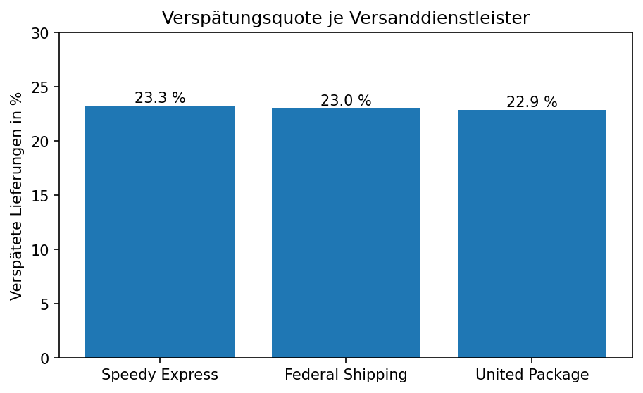
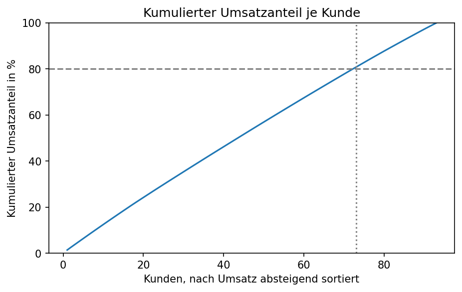

# Prozessanalyse Auftragsabwicklung
PDCA Cycle 

1. Problem
Rund 23% von allen Bestellungen kommen zu spät, somit liegt die Termintreue nur bei 77%
<!-- Welche Prozessfrage beantwortest du? Ein Satz. -->

2. Do 
16.261 Bestellungen wurdne versendet, 21 konnten ausgeschlossen werden da sie immer noch offen sind, somit nicht versendet wurden. Die durchschnittiche Durchlaufzeit leigt bei 7,8 Tagen, aber eine weite Streuung von 0 bis 30 Tagen. Verspätungsquote pro Versender liegt bei 22,9 bis 23,3% (aus Pivot ablesbar). Der Umsatz ist breit diversifiziert und 80 % des Umsatzes kommen von 73 von 93 Kunden, wobei de rgrößte Kunde nur 1,4% hat. 

3. Ursachenanalyse 
Menschen können ausgeschlossen werden da sie zwischen 7,6 und 8 Tagen liegt 
Dienstleister ausgeschlossen
Kunde ausgeschlossen, da keine Abhängigkeit von Großkunde

Methode : Hauptursache verspätete Aufträge hatten nur 6,7 Tage zugesagte Lieferzeit, obwohl die durchschnittliche Bearbeitungszeit bei 7,8 Tagen liegt, damit ist eine Zusage unter 7 Tagen unrealistisch
4. Maßnahme (Do)
zugesagte Lieferzeit anpassen um realistischere Leifertermine zu geben 

5. Wirkungsmessung (Check-Plan)
Da keine echten Zahlen zur verfügung stehen erstelle ich einen Plan an dem man messen könnte.
Wcihtigste Kennzahl ist die Verändeung in der Termintreue vom Ausgangswert von 77% Ziel lässt sich aus internen Benchmakrs aus vergangenen Jahren oder durhc die  zugesagte Lieferzeit von 10 Tagen, da dort die Termintreue schon bei 92% liegt. 
## Ergebnis
<!-- Kernaussage zuerst, dann 3 Befunde mit Zahl -->

## Empfehlungen
<!-- 3 konkrete Maßnahmen -->
